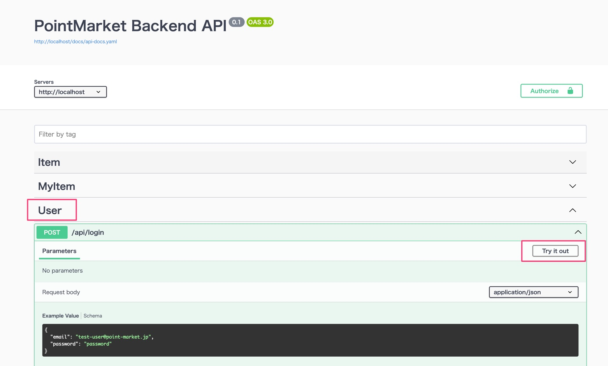
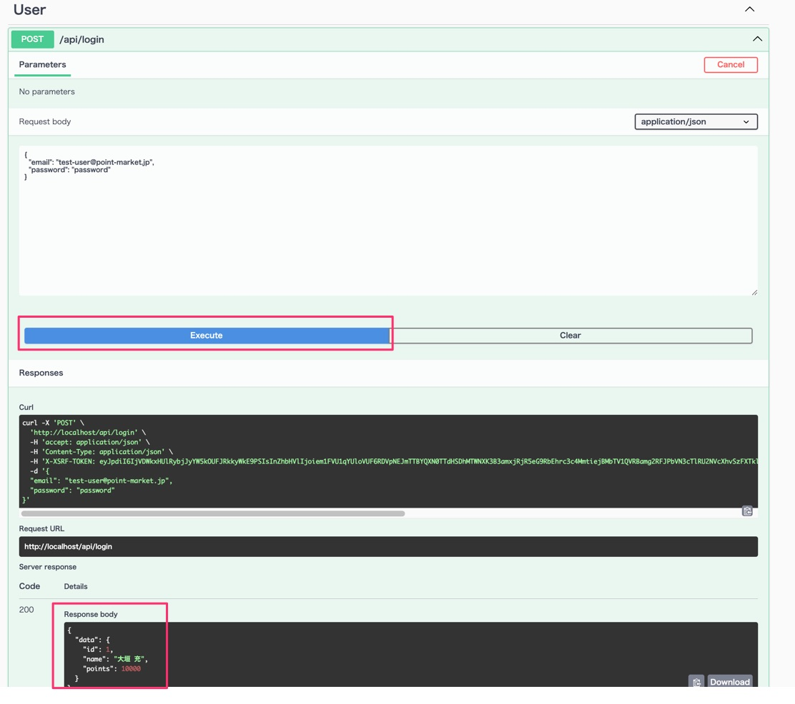
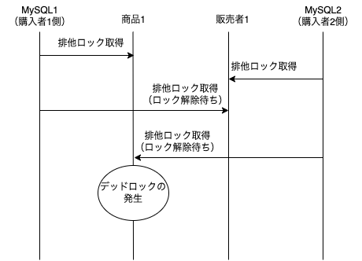
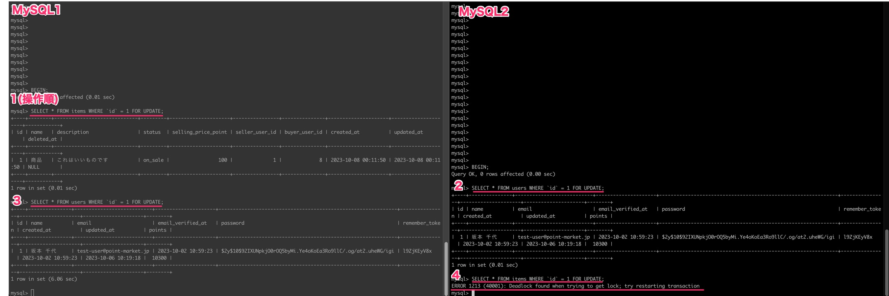
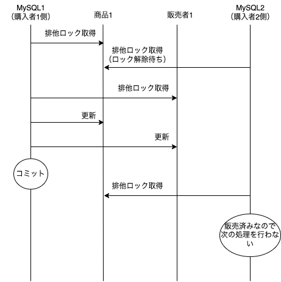

# Point Market

## 動作確認

前提
- dockerがインストール済

手順

```shell
$ git clone git@github.com:takudo/point-market.git
$ cd point-market
$ cp backend/.env.example backend/.env
$ docker-compose up
$ docker-compose exec laravel composer install
$ docker-compose exec laravel php artisan key:generate
$ docker-compose exec laravel php artisan migrate
$ docker-compose exec laravel php artisan db:seed
[一度 docker-compose を止める]
$ docker-compose up #再起動
```

### Swagger UI で動作確認する

- ブラウザで、以下にアクセスする

`http://localhost/api/documentation` （※上記コマンドをローカル端末で実施した場合のURL）

- Swagger UI 上で、 `User` の `POST /api/login` でログインする
  - email: `test-user@point-market.jp`
  - password: `password`




- ログイン後、Swagger UI にて、他の認証が必要なAPIも叩けるようになる

### 自動テスト

```shell
$ docker-compose exec laravel php artisan tests/Feature # Feature 配下のテストを実行
$ docker-compose exec laravel php artisan tests/FeatureSeparate/XxxTest.php # こちらの配下のテストはモックライブラリの影響で分割実行しないと動かないので注意
```


---

## 技術解説

### 商品購買時の排他制御

- 今回、購買時の排他制御は データベース（MySQL）側の機能を利用することにした
    - 同じ商品に対する購入のリクエストの程度は多くとも 10req/sec 程度であると仮定し、MySQL で排他制御を行う場合のロック対象を行単位とした場合、十分対処できる量であると考えた。
    - 一方、今回の処理対象は、システム内部で扱うデータのみだったためMySQLのトランザクションで対処可能と思われるが、実際には外部の決済サービスなどとのつなぎ込みによって、トランザクション処理はより複雑になることが想定される （参考記事: [Mercari マイクロサービスにおける決済トランザクション管理](https://engineering.mercari.com/blog/entry/2019-06-07-155849/)）

- MySQL の利用の前提に立つと、以下のようなデッドロックの発生が仮定できる



上記のイメージを実際に MySQL で操作すると以下のようにデッドロックが発生する



- この処理において、デッドロックの原因は排他ロックの取得順である。
  - 別データを相互にロックしようとしたときに、デッドロックになっている
  - そのため、ロックの取得順を統一する（= 必ず商品1のロックを最初に取得しようとする、など）形で回避が可能となる

以下が処理順を考慮してデッドロックを起きなくなるように修正したフローである（実際の処理は `ItemController` の `buyItem()` を参照）



#### 排他制御のテスト

- FIXME PHP において デッドロックを起こすための並列処理を簡単に書くことが難しいため、自動テストは書き起こしていない
  - 参考記事
    - https://qiita.com/kuinaein/items/0b70e40947085560b34e


### 認証

- [laravel sanctum の SPA認証](https://readouble.com/laravel/10.x/ja/sanctum.html#spa-authentication) を利用
  - FIXME [SPA認証を選んでいる理由を解説]

### OpenAPI 定義の出力（および、swagger ui）

- [swagger-php](https://zircote.github.io/swagger-php/guide/attributes.html) の Attribute で API の各ルートからOpen API 定義を出力するようにしている
- 出力されたファイルは、 `./api-docs` に吐き出される
- 同時に立ち上がる swagger-ui でも確認することができる
- Open API 定義 をコードに埋め込む考え方は [こちらの記事](https://zenn.dev/katzumi/articles/schema-driven-development-flow) を参考
- 別プロジェクトではこの定義を活用して、フロントエンド（SPA）側のAPIクライアントを自動生成するようにしていたりする。
- また、Open API 定義に則ったテストの自動化などの活用シーンもありそう。

### テスト

- Jest ライクに書ける Pest を利用

#### モックライブラリ(Mockery) の利用上の注意

- クラスメソッドのモッキングを実施している箇所があるが、これが影響範囲が大きいらしく、他のテストと一緒に混ぜて実行すると、他のテストが落ちる状況が発生した。
- `@runInSeparateProcess`,`@preserveGlobalState` のアノテーションで回避できるとのことだったが、手元ではうまく動作しないことと、こちらが[動いたとしても不安定](https://tsuyoshi-nakamura.hatenablog.com/entry/2017/11/15/190852)だという情報もあったため、一括実行とは別で単品で実行する形に切り出した。

### CI

- github actions で、PullRequest 時にテストの自動実行をするよう設定済み
  - [実行履歴](https://github.com/takudo/point-market/actions)
- 今回設定済みなのはテストの自動実行のみだが、ソースやdockerイメージのビルドをして本番環境へのデプロイまでやるケースが多い